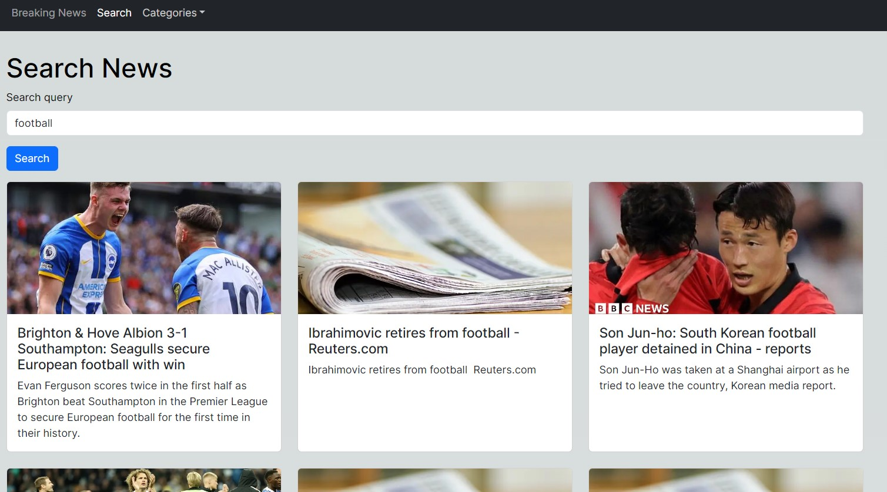

<h1>Search News App</h1>

You can find latest news here

<h2>General Information</h2>

<ul>
<li>Next.js application for displaying world's breaking news, and news by search query and by category. There're 3 pages here: Breaking News page, Search page and Category page that contains 7 categories. All news are provided by https://newsapi.org</li>
</ul><ul>
<li>You can navigate beetween pages using links on the top left corner. By clicking the news card you'll be redirected to the origin news page</li>
</ul><ul>
<li>Live page: https://nextjs-news-app-flame.vercel.app/</li></ul>
<h2>Technologies Used</h2>

<ul>
<li>HTML</li>
</ul><ul>
<li>CSS</li>
</ul><ul>
<li>JavaScript</li>
</ul><ul>
</ul><ul>
<li>TypeScript</li>
</ul><ul>
<li>Next.js</li></ul>
<h2>Screenshots</h2>

<h2>Setup</h2>

To set up the project you can clone it from this repo: https://github.com/BogdanGlazkov/nextjs-news-app
<h5>Steps</h5><ul>
<li>npm i</li>
</ul><ul>
<li>npm run dev</li>
</ul>
<h5>Code Examples</h5><ul>
<li>This project uses React function components, React hooks, bootstrap library for styling, Next.js functions getStaticPaths, getStaticProps and getServerSideProps instead of backend. Here is a code example of Footer component</li>
</ul>

<code>import s from "../styles/App.module.css";

const Footer = () => {
return (

<footer>

&copy; 2023 Created by Bogdan Glazkov

<a href="mailto:bglazkov@i.ua">bglazkov@i.ua</a>

</footer>
);
};

export default Footer;</code>

<h2>Project Status</h2>

Completed

<h2>Features that can be added</h2>

<ul>
<li>Favorite news</li>
</ul><ul>
<li>Authorization</li>
</ul>
<h2>Acknowledgement</h2>

<ul>
<li>This project was based on Codinginflow Next.js tutorials</li>
</ul><h2>Contact</h2>

